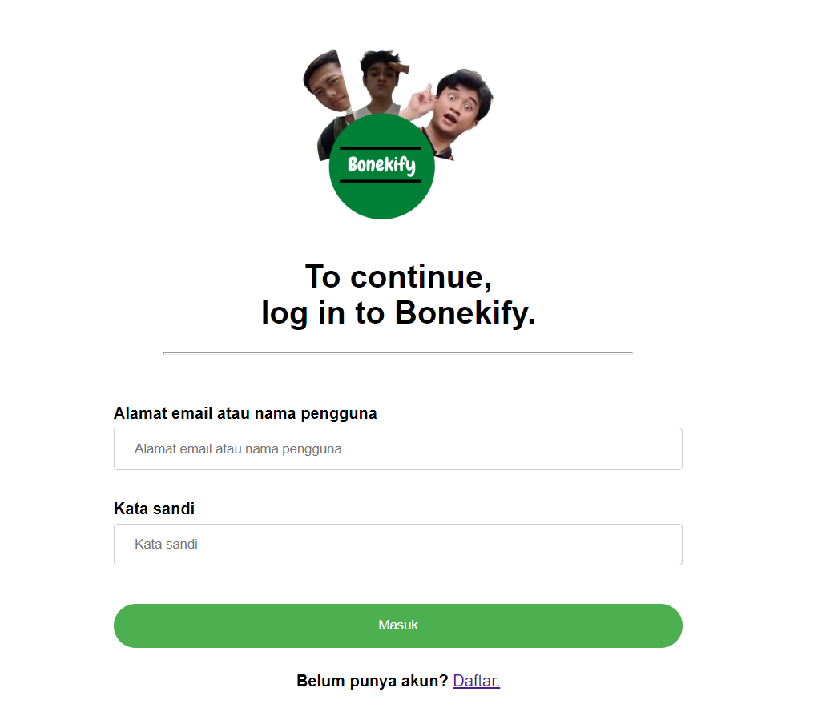
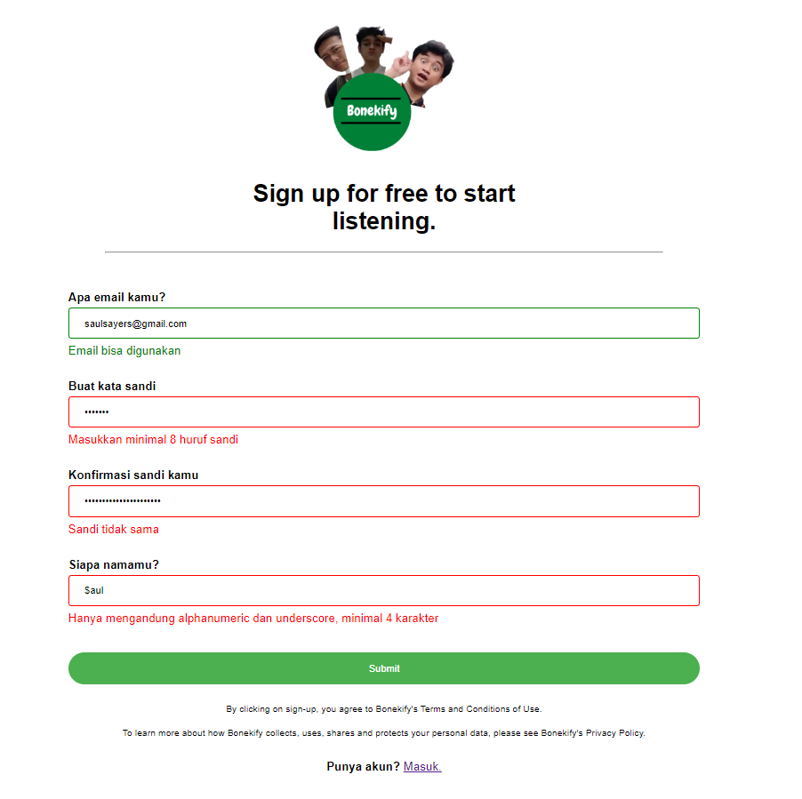

# BONEKIFY - IF3110 Web based Application Development: Major Assignment 1

Bonekify is a music streaming web application service similar to Spotify.

Users are able to search and listen to a variety of songs. Surfing and exploring new songs is a breeze as Bonekify has displays for song/album information and list. Bonekify features a song management system for admins to add, change, and delete songs/albums. Admins are also able to see the list of users using the service. Users can also listen to premium songs feature. To do so, users can subscribe to the premium singers first which then will be validated by admin from the Binotify Premium App.

Bonekify is built on vanilla HTML, CSS, and JavaScript with native PHP. Data is stored on a MySQL server.

## Table of Contents
  - [Table of Contents](#table-of-contents)
  - [Running the Server](#running-the-server)
  - [Screenshots](#screenshots)
  - [Tasks Allocation](#tasks-allocation)
  - [Perubahan Implementasi](#perubahan-implementasi)

## Running the Server
Make sure to refer requirements and installations in the Bonekify Config Repository first.
Then, you can run Docker with the command:
```
docker compose up
```

The web application will now be up and running. It is now locally accessible through port 1300.

<b><a href="http://localhost:1300/public">http://localhost:1300/public</a></b>

## Screenshots




## Tasks Allocation
This project is made by:
- <a href="https://www.linkedin.com/in/ahmad-alfani-handoyo/"> Ahmad Alfani Handoyo (13520023)</a>
- <a href="https://www.linkedin.com/in/saulsayers/?originalSubdomain=id">Saul Sayers (13520094)</a>
- <a href="https://www.linkedin.com/in/rizky-ramadhana-putra-kusnaryanto-6037a51aa/">Rizky Ramadhana Putra Kusnaryanto (13520151)</a>

Page | Client-side | Server-side 
--- | --- | ---
Login | 13520094 | 13520094
Register | 13520094 |  13520094
Home | 13520023, 13520094, 13520151| 13520094
Search, Sort, and Filter | 13520094 |  13520094
Album List | 13520023, 13520094, 13520151 |  13520151
Song Detail | 13520023, 13520151 |  13520023, 13520151
Album Detail | 13520023, 13520151 |  13520023, 13520151
Add Song | 13520023 | 13520023, 13520151
Add Album | 13520023 |  13520023, 13520151
User List | 13520023 | 13520023  
Premium Singer | 13520094 13520023 | 13520151
Premium Song | 13520094 | 13520151

## Implementation Changes
There are some implementation changes or additional features that were made from the first part of the assignment:

- Added premium singer list page. Users can request a subscription to the singer.
- Added premium song list page. Users can listen to premium songs once they have subscribed to the singer.

Both of these pages will utilize endpoints from the REST service.
